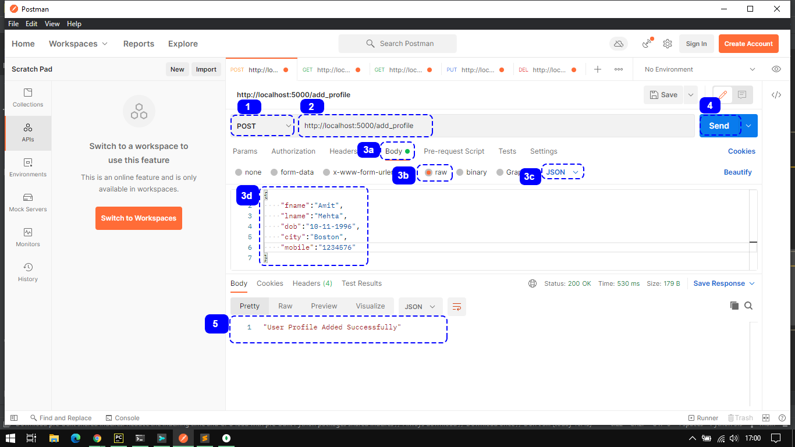
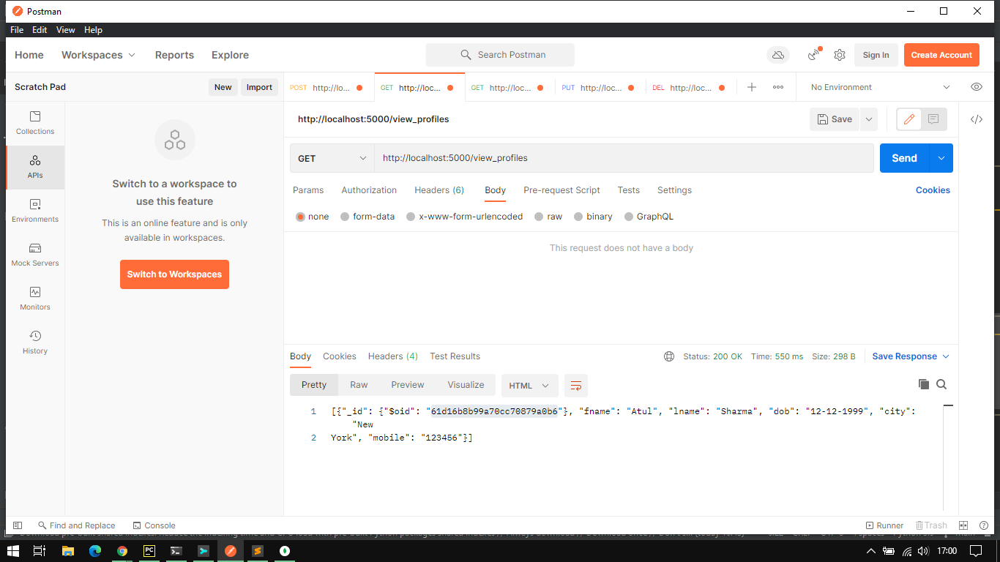
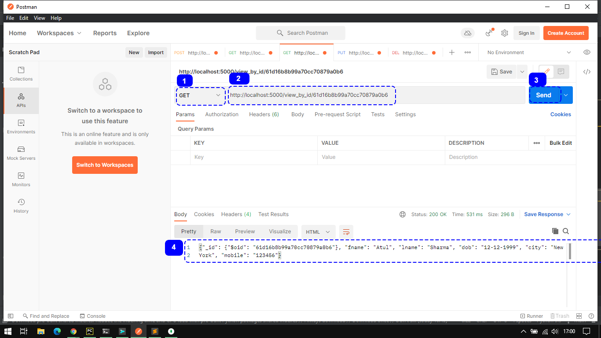
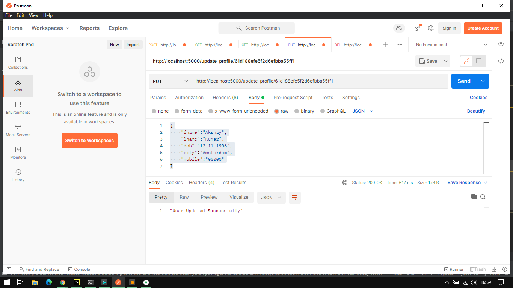

# cARscan Assignment
Submission of the Skill Test Programming Assignment for cARscan Hiring Process

## Problem Statement
- Web application to manage users in a system.
	- Simple application without any authentication required
	- One should be able to see the list of users (fname, lname, dob, city, and mobile
number).
	- Functionalities to create new users, edit existing users, & delete any user.
	- Persistent Database storage

## Approach
- Design Decision
    - Selection of MongoDB as there is not much relation between records to hold as per the requirements
    - Decided to use Flask over Django due to easier setup and familiar methods
    - View All Users and View Single User functionality should be available in such application, hence added
    - Connection to Local MongoDB is define in this API
- Testing
	- API tested using Postman API Testing Tool

## How To Test the API
### Launch the API Server
1. Using a shell or command prompt window, change directory to the root of this repository, wherever cloned
2. Use the command `python app.py`

    OR

1. In a shell or command prompt window, directly enter the command `python <path to the repository folder/app.py>`

*__Note:__ Install mentioned dependencies and the Launch the API Server, also Launch only one instance and make sure its running before testing using Postman or any other API client*

### Using Postman to Add New User Record
    
  1. Select Request Method &rarr; `POST`
  2. Type in URL &rarr; `http://localhost:5000/add_profile`
  3. Select
     1. `body` section
     2. `raw` data type
     3. `JSON` mimetype
     4. Now type in the details in **JSON format** as shown in the image above
  4. `Send` Request
  5. Response will be shown here
### Using Postman to View All User Records
    
  1. Select Request Method &rarr; `GET`
  2. Type in URL &rarr; `http://localhost:5000/view_profiles`
  3. `Send` Request
  4. Response will be shown here
### Using Postman to View Single User Record
  
  1. Select Request Method &rarr; `GET`
  2. Type in URL &rarr; `http://localhost:5000/view_by_id/record_id` where `record_id` can be taken by viewing all user records
  3. `Send` Request
  4. Response will be shown here
### Using Postman to Update Single User Record
    
  1. Select Request Method &rarr; `PUT`
  2. Type in URL &rarr; `http://localhost:5000/update_profile/record_id` where `record_id` can be taken by viewing all user records
  3. Select
     1. `body` section
     2. `raw` data type
     3. `JSON` mimetype
     4. Now type in the details in **JSON format** as shown in the image above
  4. `Send` Request
  5. Response will be shown here
### Using Postman to Delete Single User Record
    
  1. Select Request Method &rarr; `DELETE`
  2. Type in URL &rarr; `http://localhost:5000/delete_profile/record_id` where `record_id` can be taken by viewing all user records
  3. `Send` Request
  4. Response will be shown here

*__Note:__ flask app runs on port 5000 by default but port can be set at `last line` in app.py as app.run(host=HOST, port=PORT)*

## Dependencies
- Language :   
  - >[python3 (Interpreter used - python3.9.6 +)](https://www.python.org/downloads/)
- Python Packages :
  - >[flask (version 2.0.2 +)](https://pypi.org/project/Flask/) - `pip install flask`  
  - >[flask_pymongo (version 2.3.0 +)](https://pypi.org/project/Flask-PyMongo/) - `pip install Flask-PyMongo`  
  - >[bson (version 0.5.10 +)](https://pypi.org/project/bson/) - `pip install bson`
- Database :
  - >[MongoDB (version 5.0.5 +)](https://www.mongodb.com/try/download/community)
- Additional Softwares :
  - >[Postman](https://www.postman.com/downloads/)

## References
- [Flask](https://flask.palletsprojects.com/en/1.1.x/api/?highlight=flask%20flask#flask.Flask)
- [flask-jsonify](https://flask.palletsprojects.com/en/1.1.x/api/?highlight=jsonify#flask.json.jsonify)
- [flask-request](https://flask.palletsprojects.com/en/1.1.x/api/?highlight=request#flask.request)