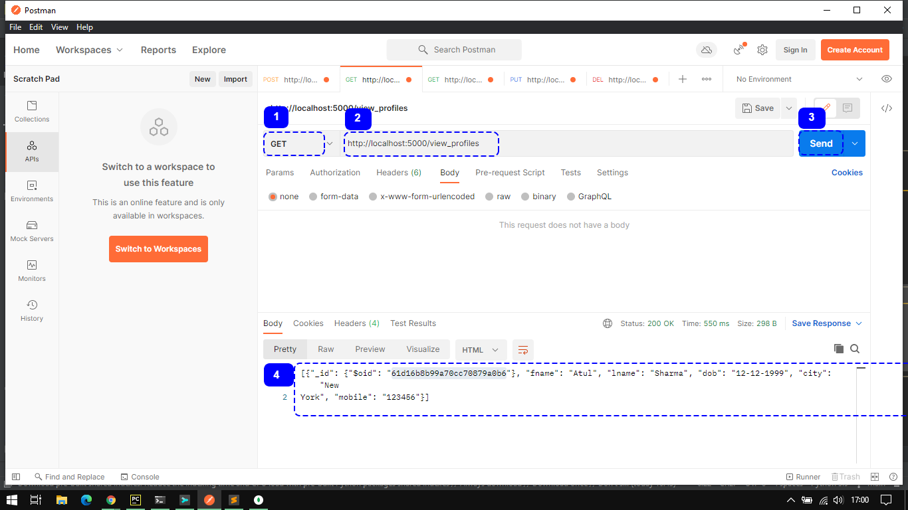
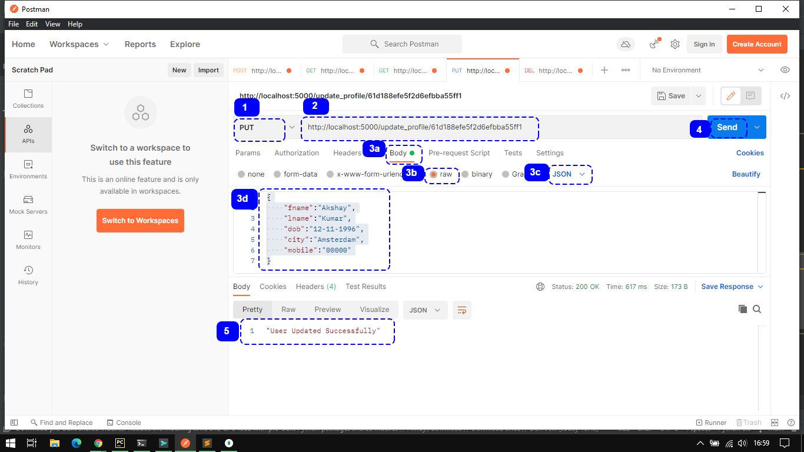
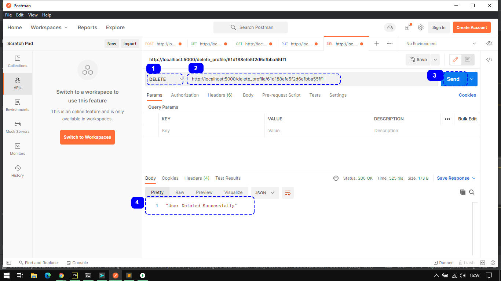

# cARscan Assignment
Submission of the Skill Test Programming Assignment for cARscan Hiring Process

## Problem Statement
- Web application to manage users in a system.
	- Simple application without any authentication required
	- One should be able to see the list of users (fname, lname, dob, city, and mobile
number).
	- Functionalities to create new users, edit existing users, & delete any user.
	- Persistent Database storage

## Approach
- Design Decision
    - Selection of MongoDB as there is not much relation between records to hold as per the requirements
    - Decided to use Flask over Django due to easier setup and familiar methods
    - View All Users and View Single User functionality should be available in such application, hence added
    - Connection to Local MongoDB is define in this API
- Testing
	- API tested using Postman API Testing Tool

## How To Test the API
- Using Postman to Add New User Record
  
- Using Postman to View All User Records
  
- Using Postman to View Single User Record
  
- Using Postman to Update Single User Record
  
- Using Postman to Delete Single User Record
  

*__Note:__ flask app runs on port 5000 by default but port can be set at `last line` in app.py as app.run(host=HOST, port=PORT)*

## Dependencies
- Language :   
  - >[python3 (Interpreter used - python3.9.6 +)](https://www.python.org/downloads/)
- Python Packages :
  - >[flask (version 2.0.2 +)](https://pypi.org/project/Flask/) - `pip install flask`  
  - >[flask_pymongo (version 2.3.0 +)](https://pypi.org/project/Flask-PyMongo/) - `pip install Flask-PyMongo`  
  - >[bson (version 0.5.10 +)](https://pypi.org/project/bson/) - `pip install bson`
- Database :
  - >[MongoDB (version 5.0.5 +)](https://www.mongodb.com/try/download/community)
- Additional Softwares :
  - >[Postman](https://www.postman.com/downloads/)

## References
- [Flask](https://flask.palletsprojects.com/en/1.1.x/api/?highlight=flask%20flask#flask.Flask)
- [flask-jsonify](https://flask.palletsprojects.com/en/1.1.x/api/?highlight=jsonify#flask.json.jsonify)
- [flask-request](https://flask.palletsprojects.com/en/1.1.x/api/?highlight=request#flask.request)